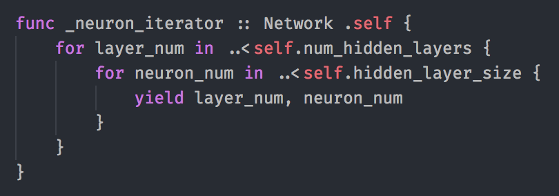
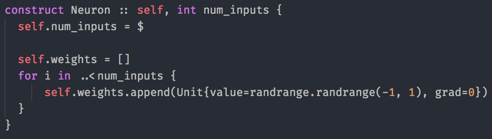
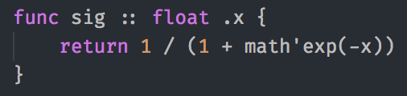
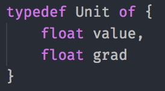

# type-lang
The specs for my dream programming language. Implementation in progress.



<br>
...

<br>
...

<br>
...



## Specs / Sample Code

### Variable Declaration

Variable declaration is _explicit_.

That way, programmers can easily overcome the confusion of scope that sometimes trips up python newbies (and non-newbies).

Example:

```
str foo = "global 1"

print(foo) // "global 1"

{
  print(foo) // "global 1"
  foo = "global 2"
  print(foo) // "global 2"
  
  var foo = "middle 1"
  print(foo) // "middle 1"
  {
    print(foo) // "middle 1"
    foo = "middle 2"
    print(foo) // "middle 2"
    
    var foo = "inner"
    print(foo) // "inner"
  }
  print(foo) // "middle 2"
}

print(foo) // "global 2"
```

### Types

Instead of Objects, this language has `types`.
Types inherit from other types.

The most generic type is `val`.
When a variable is created like `var foo = 27` or `const bar = "abc"`, it is implicitly of type `val`.

Let's define Inch and Foot types:

```
typedef Inch of float
typedef Foot of float
```

and let's use them:

```
Inch page_width = Inch{6.5}
```

We can create conversions between types:

```
conversion Inch > Foot :: value {
  return Foot{value/12}
}

conversion Foot > Inch :: value {
  return Inch{value*12}
}
```

these conversions are used automatically when needed:

```
print(Inch{18} == Foot{1.5}) // true
print(Inch{12} == Foot{3}) // false

Foot foo = Foot{1.5}

while true {
  time.sleep(1)
  foo += Inch{3} // foo is incremented by 0.25 _feet_ (thx to auto conversions)
}
```

**Cool Sample**:

```
/*
 * Unit converter
 */

type[] units = {}

fun register :: type unit, str *names -> type {
  for name in names {
    units[name] = unit
  }
  
  return unit
}

@register('in', 'inch', 'inches')
typedef Inch of float

@register('ft', 'foot', 'feet')
typedef Foot of float

@register('yd', 'yds', 'yard', 'yards')
typedef Yard of float

@register('mi', 'mile', 'miles')
typedef Mile of float


// Inch & Foot conversions
conversion Inch > Foot :: value {
  return Foot{value/12}
}

conversion Foot > Inch :: value {
  return Inch{value*12}
}

// Foot & Yard conversions
conversion Foot > Yard :: value {
  return Yard{value/3}
}

conversion Yard > Foot :: value {
  return Foot{value*3}
}

// Yard & Mile conversions
conversion Yard > Mile :: value {
  return Mile{value/1760}
}

conversion Mile > Yard :: value {
  return Yard{value*1760}
}

// Main code
float val = input('value: ')

str original_unit_name = input('original unit: ')
str desired_unit_name = input('desired unit name: ')

type original_unit = units[original_unit_name]
type desired_unit = units[desired_unit_name]

del original_unit_name // the compiler would recognize these vars as short-living, combining the previous few lines
del desired_unit_name

var original_val = original_unit{val}
var output_val = desired_unit(original_val)

print(output_val)
```

### Functions

```
func is_perfect_square :: int number -> bool {
  return sqrt(number) % 1 == 0
}
```

```
dict{str:func} operators = {
  '+': func :: float x, y -> float {return x + y},
  '-': func :: float x, y -> float {return x - y},
  '*': func :: float x, y -> float {return x * y},
  '/': func :: float x, y -> float {return x / y},
}

assert operators['*'](7, 3) == 21
```

```
(func :: float baz {
  // this is an anonymous function, btw :)
}(17)
```

## more thinking

```
func get_last_digits :: int .num, int how_many=1 -> int {
    return num % 10
}

int foo = 1291239

//

foo!get_last_digits()
foo = foo.get_last_digit()

//

foo!get_last_digits(6)
foo = foo.get_last_digit(6)

//

int bar = foo.get_last_digit()
int bar = get_last_digit(foo)

//

int bar = foo.get_last_digit(6)
int bar = get_last_digit(foo, 6)


/////

func multiply_by_val :: float .*num, float value -> float {
    return num * value
}

int a = 1,
    b = 2,
    c = 3;

(a, b, c)!multiply_by_val(7) // same as:     a, b, c = [multiply_by_val(x, 7) for x in (a, b, c)]

/////

func sum :: float .num* -> float {
    float total = 0;
    for n in num {
        total += n
    }
    return total
}

int a = 1,
    b = 2,
    c = 3;

assert (a, b, c).sum() == 6 // true
assert sum(a, b, c) == 6 // true

/////

func sum_so_far :: float .num* -> float* {
    float[] sums = []
    float total = 0;
    for n in num {
        total += n
        sums.append(total)
    }
    return sums
}

int a = 1,
    b = 2,
    c = 3;

// non mutating
assert (a, b, c).sum_so_far() == (1, 3, 6) // true
assert (a, b, c) == (1, 2, 3) // true

// mutating
assert (a, b, c)!sum_so_far() == (1, 3, 6) // true
assert (a, b, c) == (1, 3, 6) // true
```